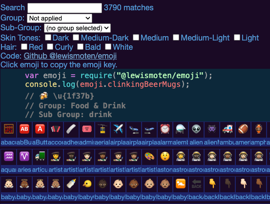

# emoji

Provides a lookup list of emoji in unicode format.

## Installation

`npm i @lewismoten/emoji -s`

## Code

The code is a simple javascript object. Here are examples of how to use it to show :beers:

## Module


```js
var emoji = require("@lewismoten/emoji");
console.log(emoji.clinkingBeerMugs);
```

## Browser

```html
<script src="./emoji.js" type="text/javascript"></script>
<script type="text/javascript">
  console.log(emoji.clinkingBeerMugs);
</script>
```

## Demo

An interactive demonstration that uses the library exposed as `window.emoji` is also included. The live demo is also hosted on GitHub pages:

<https://lewismoten.github.io/emoji/>



## Scraper

Names and codes scraped from <https://unicode.org/emoji/charts/full-emoji-list.html>

The code used to scrape the unicode web page with the emoji list is also included.
