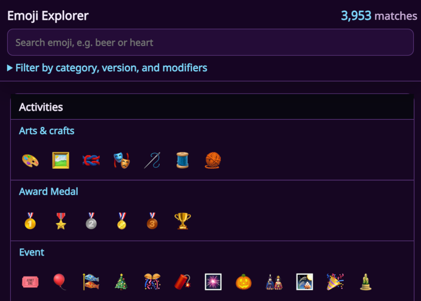

# emoji

Provides Unicode Emoji 17.0 lookup packs that can be imported or lazy-loaded by need.

The generated dataset contains every Unicode-recommended fully-qualified emoji
sequence, including skin-tone, hair, gender, family, and ZWJ variants.

## Unicode version manifests

Each `versions/<version>.json` file contains only the exported emoji keys that
were introduced in that Unicode Emoji version. Load a manifest separately when
you need to include or exclude a release without adding version metadata to the
emoji lookup itself:

```js
const introducedIn17 = await fetch('./versions/17.0.json').then(response => response.json());
```

`versions/manifest.json` lists each version file, its official release date,
and its entry count. Use its ISO date to select all version files available by
a cutoff year or date.

## Installation

`npm i @lewismoten/emoji -s`

## Code

The root export is a small, curated popular pack:

```js
import emoji from "@lewismoten/emoji";
console.log(emoji.clinkingBeerMugs);
```

## Packs

Load all emojis only when a complete lookup is needed:

```js
import emoji from "@lewismoten/emoji/all";
```

Categories are separate modules and can be lazy-loaded:

```js
const { default: people } = await import("@lewismoten/emoji/categories/people-and-body");
```

Available categories are `activities`, `animals-and-nature`, `component`, `flags`,
`food-and-drink`, `objects`, `people-and-body`, `smileys-and-emotion`, `symbols`,
and `travel-and-places`.

Variant packs are available at `variations/skin-tones`, `variations/hair`,
`variations/families`, and `variations/all`:

```js
import families from "@lewismoten/emoji/variations/families";
```

For the smallest possible static or dynamic import, use an individual module:

```js
import clinkingBeerMugs from "@lewismoten/emoji/individual/clinkingBeerMugs";
```

For direct browser use, `dist/esm/index.js` is a self-contained module containing
the complete lookup object:

```html
<script type="module">
  import emoji from "./dist/esm/index.js";
  console.log(emoji.clinkingBeerMugs);
</script>
```

## Demo

A local demo can be ran using vite

```bash
npm i
npm start
http://localhost:5173
```

The live demo is hosted on GitHub pages:

<https://lewismoten.github.io/emoji/>



## Scripts

- clean: drops the build & dist folders
- build: creates typescript
- generate: creates pack and individual source modules from `emoji.json` and `popular.json`
- bundle: creates JavaScript & TypeScript Definitions for packaging
- prepublishOnly: ensures a new bundle is created for publishing
- start: Runs demo site at http://localhost:5173
- test: builds the complete package and verifies every release data set and public pack
- unicode: downloads a Unicode Emoji version, regenerates `emoji.ts` and `emoji.json`, and rebuilds the packs
- unicode:proposed: downloads the current official Unicode draft data and writes only new candidate emoji to `proposed/`

To update to a future Unicode release, run:

```bash
npm run unicode -- 18.0
```

To inspect candidate emoji for the upcoming draft release without changing the stable package data, run:

```bash
npm run unicode:proposed
```

This writes `proposed/<draft-version>.json` and records it in `versions/manifest.json` under `proposed`. Proposed entries have no release date and are clearly marked with `"status": "proposed"`; they are separate from released version arrays because Unicode may change or remove them before release. To require a particular current draft version, pass it explicitly:

```bash
npm run unicode:proposed -- 18.0
```
