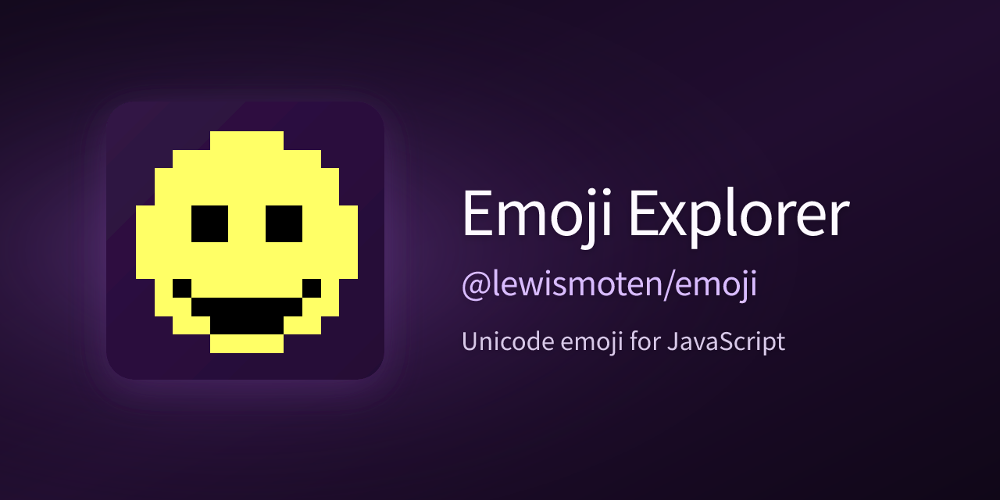
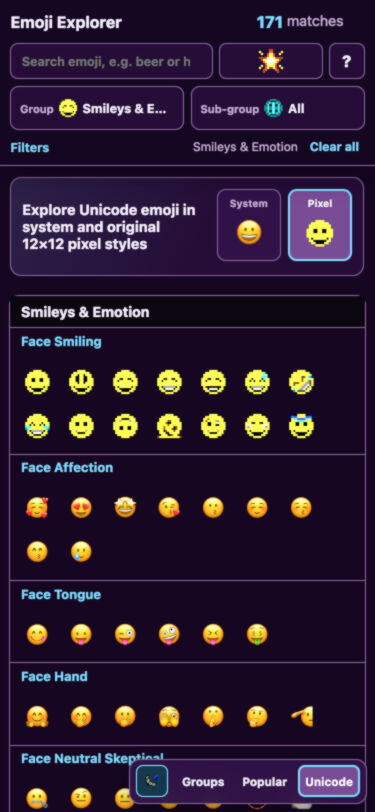
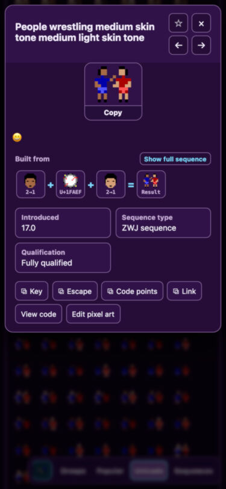
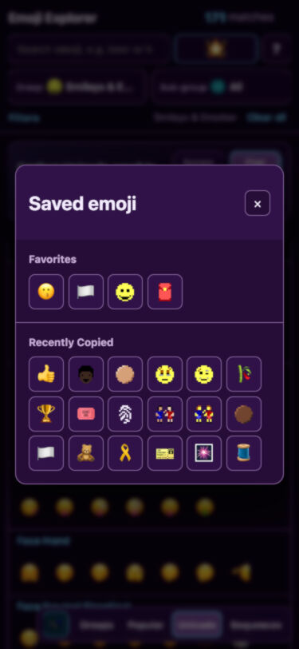
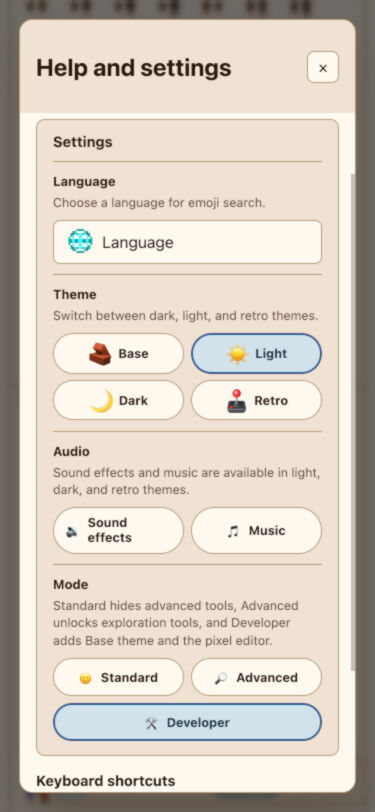
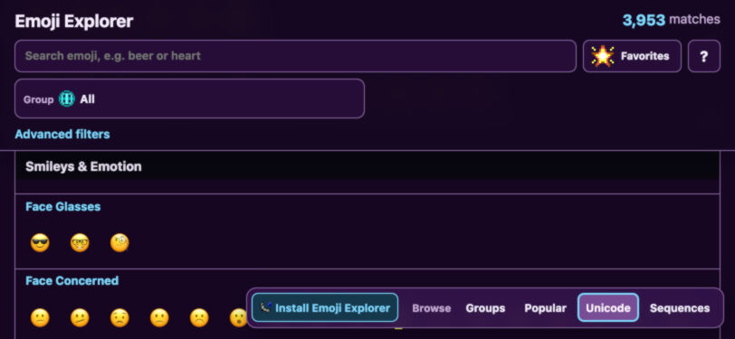
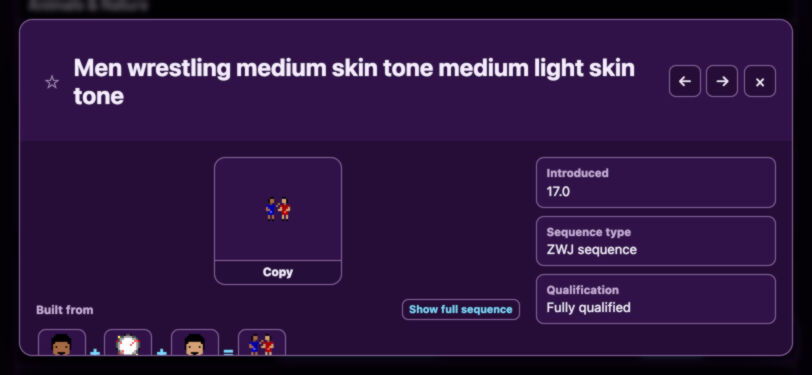

# @lewismoten/emoji

[](https://lewismoten.github.io/emoji/)

This repository brings together three connected projects:

- **Emoji Explorer:** a localized, installable Unicode research and discovery
  app with search, filters, sequence visualization, rendering diagnostics,
  favorites, and offline support.
- **Pixel Emoji:** an original 12×12 color font and pixel-art editor designed to
  provide newer emoji on devices whose operating-system fonts are no longer
  updated.
- **`@lewismoten/emoji`:** typed JavaScript lookup packs containing every
  Unicode-recommended fully-qualified sequence, including skin-tone, hair,
  gender, family, and ZWJ variants.

Proposed Emoji 18.0 candidates remain separate from released emoji throughout
the package, Explorer, and font.

[Explore the emoji](https://lewismoten.github.io/emoji/) ·
[View the package on npm](https://www.npmjs.com/package/@lewismoten/emoji) ·
[Download the Pixel Emoji fallback font](pixel-font/PIXEL_EMOJI.md)

## Installation

```bash
npm install @lewismoten/emoji
```

## Quick start

The root export is a small, curated popular pack:

```js
import emoji from "@lewismoten/emoji";

console.log(emoji.clinkingBeerMugs); // 🍻
```

Import the complete lookup only when it is needed:

```js
import emoji from "@lewismoten/emoji/all";

console.log(emoji.wrappedGift); // 🎁
```

CommonJS is also supported:

```js
const emoji = require("@lewismoten/emoji/all");
```

### TypeScript

Every JavaScript export includes declarations with exact emoji keys. Editors
can autocomplete expressions such as `emoji.` and show declaration comments
that include the emoji name and glyph.

## What you can import

- root export: curated popular emoji
- `@lewismoten/emoji/all`: complete released emoji lookup
- `@lewismoten/emoji/categories/*`: Unicode category packs and subgroup packs
- `@lewismoten/emoji/variations/*`: skin tone, hair, families, or all
  variations
- `@lewismoten/emoji/search`: localized search helpers
- `@lewismoten/emoji/locales/*`: locale JSON packs
- `@lewismoten/emoji/orders/*`: Unicode ordering data
- `@lewismoten/emoji/versions/*`: released version introduction lists
- `@lewismoten/emoji/proposed/*`: draft Unicode candidates

For the deeper package guide, examples, manifests, localization notes, and
version filtering details, see [docs/package-usage.md](docs/package-usage.md).

## Emoji Explorer

The [live Emoji Explorer](https://lewismoten.github.io/emoji/) is the visual
front end for the data and font projects. It provides:

- localized names, keywords, group labels, and subgroup labels
- browsing by Unicode group, subgroup, release, modifier, and sequence type
- popular-mode browsing for the curated root-export emoji set
- system-versus-Pixel Emoji comparisons and split-sequence diagnostics
- visual explanations of ZWJ, modifier, flag, keycap, and tag sequences
- favorites, recently copied emoji, keyboard navigation, and shareable URLs
- an integrated 12×12 pixel-art editor
- theme, mode, and audio controls
- responsive dialogs and an installable offline PWA

Casual browsing keeps search and category shortcuts immediately available.
The app offers three user modes from Help and settings:

- **Standard:** simple browsing, search, copy, favorites, and installation
- **Advanced:** adds richer filtering, Unicode ordering, and technical lookup
  tools without editor-focused controls
- **Developer:** adds sequence construction, rendering diagnostics, code tools,
  and the pixel editor

This keeps end-user browsing lightweight while still exposing the deeper
Unicode and font tooling when it is needed.

### Current app previews

Click a thumbnail to view the full-size capture. Narrow screenshots show the
mobile layout; wide screenshots show the short landscape layout used by the
PWA manifest.

<p>
  <a href="./src/site/pwa/narrow/screenshot-explorer.jpg">
    
  </a>
  <a href="./src/site/pwa/narrow/screenshot-emoji.jpg">
    
  </a>
  <a href="./src/site/pwa/narrow/screenshot-saved.jpg">
    
  </a>
  <a href="./src/site/pwa/narrow/screenshot-help.jpg">
    
  </a>
</p>

<p>
  <a href="./src/site/pwa/wide/screenshot-explorer.jpg">
    
  </a>
  <a href="./src/site/pwa/wide/screenshot-emoji.jpg">
    
  </a>
</p>

## Pixel Emoji fallback font

[Pixel Emoji](pixel-font/PIXEL_EMOJI.md) is a compact 12×12 color fallback font for
new emoji that older operating-system fonts cannot display. Its custom artwork
currently covers every entry introduced with Emoji 16.0 and 17.0, plus every
entry in the currently tracked Emoji 18.0 beta draft.

For websites, install the dedicated font package:

```bash
npm install @lewismoten/pixel-emoji
```

```css
@import "@lewismoten/pixel-emoji";
```

**Released:** [TTF](https://lewismoten.github.io/emoji/pixel-font/build/font/pixel-emoji.ttf) ·
[WOFF2](https://lewismoten.github.io/emoji/pixel-font/build/font/pixel-emoji.woff2) ·
**Proposed:** [TTF](https://lewismoten.github.io/emoji/pixel-font/build/font/proposed/pixel-emoji.ttf) ·
[WOFF2](https://lewismoten.github.io/emoji/pixel-font/build/font/proposed/pixel-emoji.woff2) ·
[Web-font CSS](https://lewismoten.github.io/emoji/pixel-font/build/font/pixel-emoji.css)

See [pixel-font/PIXEL_EMOJI.md](pixel-font/PIXEL_EMOJI.md) for coverage,
design constraints, atlas details, sequence handling, and local build notes.

## Repository asset pipeline

Site-facing SVG assets are generated from live pixel-font artwork where
appropriate. The icon smiley used by the favicon, maskable icon, and social
preview is configured in
[src/site/smiley-source.json](src/site/smiley-source.json), then synchronized
into the SVG source files before their PNG counterparts are rendered.

To refresh those assets directly:

```bash
npm run svg:render
```

## Local development

Run the Explorer locally with Vite:

```bash
npm install
npm start
```

Then open <http://localhost:5173/>. Localized routes such as
<http://localhost:5173/index.ar.html> are generated in memory by Vite.

For local publishing, website deployment, Unicode updates, snapshot refreshes,
and development scripts, see [docs/development-guide.md](docs/development-guide.md).

## Version contract testing

Released Unicode data is protected by checked-in snapshot contracts. If a key
name changes, an emoji sequence changes, a code-point string changes, or an
emoji disappears from `@lewismoten/emoji/all`, tests fail loudly.

When a Unicode rename or sequence change is intentional, refresh the contract
snapshot with:

```bash
npm run versions:snapshot
```

For the full workflow, see
[docs/version-contracts.md](docs/version-contracts.md).

## Data attribution and license

The package source code is distributed under the [ISC license](LICENSE.md).

Generated emoji, ordering, release, localization, and proposed data are derived
from Unicode and CLDR data files. Unicode data is distributed under the Unicode
License v3 (`Unicode-3.0`). See [NOTICE.md](NOTICE.md) for the copyright,
permission, attribution, and trademark notices. The Unicode word mark and logo
are not used to endorse this package.
