# Pixel Emoji atlas gallery

[Back to the font README](README.md)

This generated gallery lists every source atlas PNG that currently contains
painted artwork. The font build reads these sheets and compiles only their
nontransparent 12×12 cells.

16 painted atlas sheets are currently available.

> Generated by `npm run pixel-font:build`. Edit the PNG atlases rather than
> this file.

## Base atlases

### Smileys & Emotion

#### face-smiling

14 painted glyphs · [PNG](atlases/smileys-and-emotion/face-smiling.png) · [JSON cell map](atlases/smileys-and-emotion/face-smiling.json)

#### face-concerned

1 painted glyph · [PNG](atlases/smileys-and-emotion/face-concerned.png) · [JSON cell map](atlases/smileys-and-emotion/face-concerned.json)

[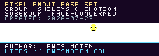](atlases/smileys-and-emotion/face-concerned.png)

#### emotion

1 painted glyph · [PNG](atlases/smileys-and-emotion/emotion.png) · [JSON cell map](atlases/smileys-and-emotion/emotion.json)

[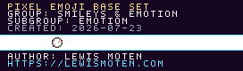](atlases/smileys-and-emotion/emotion.png)

### People & Body

#### person

1 painted glyph · [PNG](atlases/people-and-body/person.png) · [JSON cell map](atlases/people-and-body/person.json)

#### person-fantasy

1 painted glyph · [PNG](atlases/people-and-body/person-fantasy.png) · [JSON cell map](atlases/people-and-body/person-fantasy.json)

[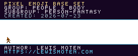](atlases/people-and-body/person-fantasy.png)

#### person-activity

2 painted glyphs · [PNG](atlases/people-and-body/person-activity.png) · [JSON cell map](atlases/people-and-body/person-activity.json)

[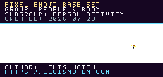](atlases/people-and-body/person-activity.png)

### Animals & Nature

#### animal-marine

1 painted glyph · [PNG](atlases/animals-and-nature/animal-marine.png) · [JSON cell map](atlases/animals-and-nature/animal-marine.json)

[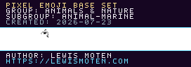](atlases/animals-and-nature/animal-marine.png)

### Travel & Places

#### place-geographic

1 painted glyph · [PNG](atlases/travel-and-places/place-geographic.png) · [JSON cell map](atlases/travel-and-places/place-geographic.json)

[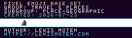](atlases/travel-and-places/place-geographic.png)

### Objects

#### clothing

1 painted glyph · [PNG](atlases/objects/clothing.png) · [JSON cell map](atlases/objects/clothing.json)

[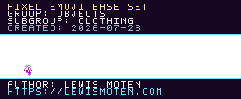](atlases/objects/clothing.png)

#### musical-instrument

1 painted glyph · [PNG](atlases/objects/musical-instrument.png) · [JSON cell map](atlases/objects/musical-instrument.json)

[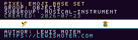](atlases/objects/musical-instrument.png)

#### money

1 painted glyph · [PNG](atlases/objects/money.png) · [JSON cell map](atlases/objects/money.json)

### Symbols

#### gender

2 painted glyphs · [PNG](atlases/symbols/gender.png) · [JSON cell map](atlases/symbols/gender.json)

## Skin-tone modifier atlases

### People & Body

#### person

5 painted glyphs · [PNG](atlases/modifiers/skin-tone/people-and-body/person.png) · [JSON cell map](atlases/modifiers/skin-tone/people-and-body/person.json)

[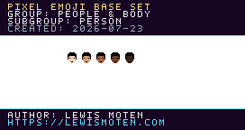](atlases/modifiers/skin-tone/people-and-body/person.png)

#### person-activity — part 2 of 3

16 painted glyphs · [PNG](atlases/modifiers/skin-tone/people-and-body/person-activity-02.png) · [JSON cell map](atlases/modifiers/skin-tone/people-and-body/person-activity-02.json)

[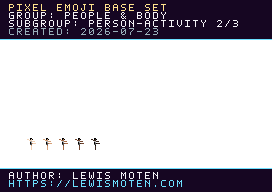](atlases/modifiers/skin-tone/people-and-body/person-activity-02.png)

#### person-activity — part 3 of 3

5 painted glyphs · [PNG](atlases/modifiers/skin-tone/people-and-body/person-activity-03.png) · [JSON cell map](atlases/modifiers/skin-tone/people-and-body/person-activity-03.json)

[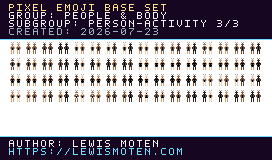](atlases/modifiers/skin-tone/people-and-body/person-activity-03.png)

### Component

#### skin-tone

5 painted glyphs · [PNG](atlases/modifiers/skin-tone/component/skin-tone.png) · [JSON cell map](atlases/modifiers/skin-tone/component/skin-tone.json)

