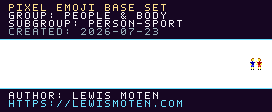
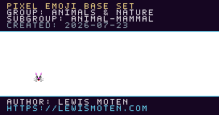
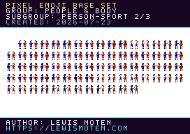
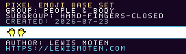
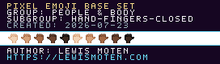

# Pixel Emoji atlas gallery

[Back to the font README](README.md)

This generated gallery lists every source atlas PNG that currently contains
painted artwork. The font build reads these sheets and compiles only their
nontransparent 12×12 cells.

28 painted atlas sheets are currently available.

> Generated by `npm run pixel-font:build`. Edit the PNG atlases rather than
> this file.

## Base atlases

### Smileys & Emotion

#### face-smiling

[PNG](atlases/smileys-and-emotion/face-smiling.png) · [JSON cell map](atlases/smileys-and-emotion/face-smiling.json)

#### face-concerned

[PNG](atlases/smileys-and-emotion/face-concerned.png) · [JSON cell map](atlases/smileys-and-emotion/face-concerned.json)

#### emotion

[PNG](atlases/smileys-and-emotion/emotion.png) · [JSON cell map](atlases/smileys-and-emotion/emotion.json)

### People & Body

#### person

[PNG](atlases/people-and-body/person.png) · [JSON cell map](atlases/people-and-body/person.json)

#### person-fantasy

[PNG](atlases/people-and-body/person-fantasy.png) · [JSON cell map](atlases/people-and-body/person-fantasy.json)

#### person-activity

[PNG](atlases/people-and-body/person-activity.png) · [JSON cell map](atlases/people-and-body/person-activity.json)

#### person-sport

[PNG](atlases/people-and-body/person-sport.png) · [JSON cell map](atlases/people-and-body/person-sport.json)

### Animals & Nature

#### animal-mammal

[PNG](atlases/animals-and-nature/animal-mammal.png) · [JSON cell map](atlases/animals-and-nature/animal-mammal.json)

#### animal-marine

[PNG](atlases/animals-and-nature/animal-marine.png) · [JSON cell map](atlases/animals-and-nature/animal-marine.json)

### Travel & Places

#### place-geographic

[PNG](atlases/travel-and-places/place-geographic.png) · [JSON cell map](atlases/travel-and-places/place-geographic.json)

### Objects

#### clothing

[PNG](atlases/objects/clothing.png) · [JSON cell map](atlases/objects/clothing.json)

#### musical-instrument

[PNG](atlases/objects/musical-instrument.png) · [JSON cell map](atlases/objects/musical-instrument.json)

#### money

[PNG](atlases/objects/money.png) · [JSON cell map](atlases/objects/money.json)

### Symbols

#### gender

[PNG](atlases/symbols/gender.png) · [JSON cell map](atlases/symbols/gender.json)

## Skin-tone modifier atlases

### People & Body

#### person

[PNG](atlases/modifiers/skin-tone/people-and-body/person.png) · [JSON cell map](atlases/modifiers/skin-tone/people-and-body/person.json)

#### person-activity — part 2 of 3

[PNG](atlases/modifiers/skin-tone/people-and-body/person-activity-02.png) · [JSON cell map](atlases/modifiers/skin-tone/people-and-body/person-activity-02.json)

#### person-activity — part 3 of 3

[PNG](atlases/modifiers/skin-tone/people-and-body/person-activity-03.png) · [JSON cell map](atlases/modifiers/skin-tone/people-and-body/person-activity-03.json)

#### person-sport — part 2 of 3

[PNG](atlases/modifiers/skin-tone/people-and-body/person-sport-02.png) · [JSON cell map](atlases/modifiers/skin-tone/people-and-body/person-sport-02.json)

### Component

#### skin-tone

[PNG](atlases/modifiers/skin-tone/component/skin-tone.png) · [JSON cell map](atlases/modifiers/skin-tone/component/skin-tone.json)

## Proposed Emoji 18.0 (beta; expected 2026-09) — Base atlases

### Smileys & Emotion

#### face-smiling

[PNG](atlases/proposed/18.0/smileys-and-emotion/face-smiling.png) · [JSON cell map](atlases/proposed/18.0/smileys-and-emotion/face-smiling.json)

### People & Body

#### hand-fingers-closed

[PNG](atlases/proposed/18.0/people-and-body/hand-fingers-closed.png) · [JSON cell map](atlases/proposed/18.0/people-and-body/hand-fingers-closed.json)

### Animals & Nature

#### animal-bug

[PNG](atlases/proposed/18.0/animals-and-nature/animal-bug.png) · [JSON cell map](atlases/proposed/18.0/animals-and-nature/animal-bug.json)

### Food & Drink

#### food-vegetable

[PNG](atlases/proposed/18.0/food-and-drink/food-vegetable.png) · [JSON cell map](atlases/proposed/18.0/food-and-drink/food-vegetable.json)

### Travel & Places

#### transport-water

[PNG](atlases/proposed/18.0/travel-and-places/transport-water.png) · [JSON cell map](atlases/proposed/18.0/travel-and-places/transport-water.json)

#### sky & weather

[PNG](atlases/proposed/18.0/travel-and-places/sky-and-weather.png) · [JSON cell map](atlases/proposed/18.0/travel-and-places/sky-and-weather.json)

### Objects

#### writing

[PNG](atlases/proposed/18.0/objects/writing.png) · [JSON cell map](atlases/proposed/18.0/objects/writing.json)

#### tool

[PNG](atlases/proposed/18.0/objects/tool.png) · [JSON cell map](atlases/proposed/18.0/objects/tool.json)

## Proposed Emoji 18.0 (beta; expected 2026-09) — Skin-tone modifier atlases

### People & Body

#### hand-fingers-closed

[PNG](atlases/proposed/18.0/modifiers/skin-tone/people-and-body/hand-fingers-closed.png) · [JSON cell map](atlases/proposed/18.0/modifiers/skin-tone/people-and-body/hand-fingers-closed.json)

