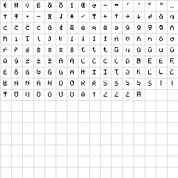

# Retro text font

The Emoji Explorer retro theme also uses a separate pixel text font for UI
labels, headings, and buttons. Unlike the emoji font, this face is a compact
Latin bitmap-inspired companion intended for ordinary interface text rather
than Unicode emoji sequences.

## Purpose

The retro theme is meant to feel cohesive rather than merely recolored. The
5×7 text face helps that mode read like a deliberate visual system:

- headings and controls feel consistent with the 12×12 emoji artwork
- sizes can snap cleanly to multiples of the 7-pixel cap height
- retro mode can avoid relying on rounded, anti-aliased system text

The font is used by the Explorer UI and is not published as a separate npm
package today.

Today this retro text font is only intended for Latin-based interface text,
such as English and Spanish. It is a good fit for languages that can be shown
clearly in a compact 5×7 bitmap style, but it is not meant to cover every
script used by the Explorer.

Chinese Pinyin was considered as a retro-friendly alternative because it uses
Latin letters, but it has not been adopted. It would need its own separate
translation layer rather than simply reusing the Chinese locale, and I am not
yet confident that a Pinyin-only retro presentation would feel natural or
helpful to native Chinese speakers. For now, non-Latin UI languages should be
treated as system-font territory rather than retro-text targets.

## Supported Latin coverage

The current goal is practical support for common Latin-script localization
rather than every possible Latin-derived alphabet.

### Western European language coverage

| Language   | Characters beyond common English                                  |
| ---------- | ----------------------------------------------------------------- |
| English    | —                                                                 |
| Spanish    | `Á É Í Ñ Ó Ú Ü á é í ñ ó ú ü`                                     |
| Portuguese | `Á Â Ã À Ç É Ê Í Ó Ô Õ Ú Ü á â ã à ç é ê í ó ô õ ú ü`             |
| Italian    | `À È É Ì Í Î Ò Ó Ù à è é ì í î ò ó ù`                             |
| French     | `À Â Æ Ç É È Ê Ë Î Ï Ô Œ Ù Û Ü Ÿ à â æ ç é è ê ë î ï ô œ ù û ü ÿ` |
| German     | `Ä Ö Ü ẞ ß ä ö ü`                                                 |
| Dutch      | `Ë Ï Ö Ü ë ï ö ü`                                                 |
| Danish     | `Æ Ø Å æ ø å`                                                     |
| Norwegian  | `Æ Ø Å æ ø å`                                                     |
| Swedish    | `Å Ä Ö å ä ö`                                                     |
| Icelandic  | `Á Ð É Í Ó Ú Ý Þ Æ Ö á ð é í ó ú ý þ æ ö`                         |

### Shared symbols and punctuation

The shared symbols listed below are implemented in the current build of the
retro text font.

| Category                  | Characters          |
| ------------------------- | ------------------- |
| Currency and commerce     | `£ € ¥ ¢ №`         |
| Quotes and dashes         | `" ' “ ” ‘ ’ – — …` |
| UI and editorial marks    | `© ® ™ § ¶ † ‡ •`   |
| Math and signs            | `× ÷ − ± °`         |
| Spanish-style punctuation | `¡ ¿`               |
| Navigation and status     | `← ↑ → ↓ ↩ ⚠ ✓ ♪`   |

### Central and Eastern European coverage

The current build now includes the commonly needed Latin extensions for the
language groups below.

| Language group                       | Often-needed characters                                               |
| ------------------------------------ | --------------------------------------------------------------------- |
| Polish                               | `Ą Ć Ę Ł Ń Ó Ś Ź Ż ą ć ę ł ń ó ś ź ż`                                 |
| Czech                                | `Á Č Ď É Ě Í Ň Ó Ř Š Ť Ú Ů Ý Ž á č ď é ě í ň ó ř š ť ú ů ý ž`         |
| Slovak                               | `Á Ä Č Ď É Í Ĺ Ľ Ň Ó Ô Ŕ Š Ť Ú Ý Ž á ä č ď é í ĺ ľ ň ó ô ŕ š ť ú ý ž` |
| Slovene / Croatian / Serbian (Latin) | `Č Ć Đ Š Ž č ć đ š ž`                                                 |
| Romanian                             | `Ă Â Î Ș Ț ă â î ș ț`                                                 |
| Baltic languages                     | `Ā Č Ē Ģ Ī Ķ Ļ Ņ Š Ū Ž ā č ē ģ ī ķ ļ ņ š ū ž`                         |
| Hungarian                            | `Á É Í Ó Ö Ő Ú Ü Ű á é í ó ö ő ú ü ű`                                 |

### Additional Latin coverage

The current build also includes the commonly needed characters for these
additional Latin-script language groups.

| Language group               | Often-needed characters               |
| ---------------------------- | ------------------------------------- |
| Turkish                      | `Ç Ğ İ Ö Ş Ü ç ğ ı ö ş ü`             |
| Esperanto                    | `Ĉ Ĝ Ĥ Ĵ Ŝ Ŭ ĉ ĝ ĥ ĵ ŝ ŭ`             |
| Welsh                        | `Ŵ Ŷ ŵ ŷ`                             |
| Maltese                      | `Ċ Ġ Ħ Ż ċ ġ ħ ż`                     |
| Azerbaijani                  | `Ə Ğ İ Ö Ş Ü Ç ə ğ ı ö ş ü ç`         |
| Lithuanian                   | `Ą Č Ę Ė Į Š Ų Ū Ž ą č ę ė į š ų ū ž` |
| Sámi                         | `Á Č Đ Ŋ Š Ŧ Ž á č đ ŋ š ŧ ž`         |
| Vietnamese core letters      | `Ă Â Ê Ô Ơ Ư Đ ă â ê ô ơ ư đ`         |
| Latin Extended practical set | `Ĕ Ĩ IJ Ō Ŏ Ŗ Ţ Ũ ĕ ĩ ij ŏ ŗ ţ ũ`       |

### African Latin coverage

The current build also includes a practical batch of Latin letters commonly
used by several African writing systems and regional orthographies.

| Language group        | Often-needed characters                   |
| --------------------- | ----------------------------------------- |
| Hausa core letters    | `Ɓ Ɗ Ƙ ɓ ɗ ƙ`                             |
| Yoruba                | `Ẹ Ọ Ṣ ẹ ọ ṣ`                             |
| Igbo                  | `Ị Ṅ Ọ Ụ ị ṅ ọ ụ`                         |
| Fula / Fulfulde       | `Ɓ Ɗ Ŋ Ñ Ƴ ɓ ɗ ŋ ñ ƴ`                     |
| Ewe                   | `Ɖ Ɛ Ƒ Ɣ Ŋ Ɔ Ʋ ɖ ɛ ƒ ɣ ŋ ɔ ʋ`             |
| Akan / Twi            | `Ɛ Ɔ ɛ ɔ`                                 |
| Bambara               | `Ɛ Ɲ Ɔ ɛ ɲ ɔ`                             |
| Lingala               | `Ɛ Ɔ ɛ ɔ`                                 |
| Pan-Nigerian core set | `Ɓ Ɗ Ɛ Ƒ Ɠ Ƙ Ɲ Ɔ Ʋ Ƴ ɓ ɗ ɛ ƒ ɣ ƙ ɲ ɔ ʋ ƴ` |

Future additions may still be needed for other Latin-based languages, but the
current coverage now spans common Western, Central, Eastern, African, and
several other practical Latin-script UI needs.

## Source format

The retro text font is now sourced from editable bitmap assets rather than a
hardcoded character table.

- [Latin-1 atlas PNG](retro-text/latin-1.png)
- [Latin-1 row/cell JSON map](retro-text/latin-1.json)
- [Extended Latin & symbols atlas PNG](retro-text/extended-latin-and-symbols.png)
- [Extended Latin & symbols row/cell JSON map](retro-text/extended-latin-and-symbols.json)
- [Source manifest](retro-text/manifest.json)
- [Sample phrase preview](retro-text/example-phrase.png)

The atlas uses a 16×16 grid of cells inside a 256×256 PNG. Each cell maps to
one character slot, and the adjacent JSON file lists the characters as arrays
of rows containing arrays of cells.

That keeps the source easy to inspect visually, easy to edit in an image
editor, and easy to extend later with more 256-cell pages for additional
character ranges. The first page currently covers Latin-1, while the second
page holds supplementary Latin letters plus shared symbols that the retro UI
uses, such as the euro sign, curly quotes, and arrow-key icons.




The sample preview currently renders both of these sentences:

> A fuzzy wizard quietly vexes Jack by throwing six emoji pompoms.
>
> À fuzzy wizard named Zoë quietly vexes Jack with six emoji: café,
> piñata, jalapeño, crème brûlée, smörgåsbord, Æsir, œuvre, Straße,
> £10, €20 — “Voilà!”
>
> Ɓ Ɗ Ƙ Ẹ Ọ Ṣ Ị Ṅ Ụ Ɖ Ɛ Ƒ Ɣ Ɔ Ʋ Ƴ Ɲ ɓ ɗ ƙ ẹ ọ ṣ ị ṅ ụ ɖ ɛ ƒ ɣ ɔ ʋ ƴ ɲ


## Current build size

<!-- retro-text-build-stats:start -->

As of the current build, Pixel Latin Retro contains 368 glyphs and ships as:

| File                      |         Size |
| ------------------------- | -----------: |
| `pixel-latin-retro.ttf`   | 30,520 bytes |
| `pixel-latin-retro.woff`  |  9,064 bytes |
| `pixel-latin-retro.woff2` |  5,284 bytes |
| `pixel-latin-retro.css`   |    290 bytes |
| `manifest.json`           |    563 bytes |

At the moment, aggressive size optimization is not a priority because the compiled font is already small:

- `pixel-latin-retro.ttf`: about 29.8 KB
- `pixel-latin-retro.woff`: about 8.9 KB
- `pixel-latin-retro.woff2`: about 5.2 KB
- `manifest.json`: about 0.5 KB

<!-- retro-text-build-stats:end -->

For web use, the WOFF2 file is the main delivery target and is currently
about 5 KB.

## Optimization headroom

The current bitmap set contains 368 glyph mappings backed by 347 unique 5×7
bitmaps, so 21 glyphs currently reuse a shape that another character already
uses. That is about 5.7% duplicate bitmap coverage.

If every duplicate shape were intentionally aliased or removed with no visual
tradeoffs, the rough upper-bound savings would be about:

| File                      | Approximate maximum savings |
| ------------------------- | --------------------------: |
| `pixel-latin-retro.ttf`   |                     ~3.8 KB |
| `pixel-latin-retro.woff`  |                     ~0.5 KB |
| `pixel-latin-retro.woff2` |                     ~0.3 KB |

In practice, real savings would likely be a bit smaller, because some of those
duplicate shapes are currently acceptable stand-ins while others may actually
deserve distinct redraws. For example, some breve and macron variants still
collapse into the same visible 5×7 silhouette, which is a design question as
much as a compression question.

## Build

Generate the retro text font with:

```sh
npm run pixel-font:text
```

This rebuilds the generated bitmap module, refreshes the sample preview, and
writes the compiled font output under `pixel-font/build-retro-text/`.

## Current compiler behavior

The current retro text compiler is intentionally simpler than the emoji font
compiler:

- glyphs are exported as monochrome TrueType outlines rather than COLR/CPAL
  color layers
- internal glyph names follow `uXXXX` code-point names such as `u0041`
- connected bitmap regions are traced as merged outlines rather than emitted
  one pixel-square at a time

It does not have a separate optimization mode comparable to the emoji font’s
optimized build. Because this font is monochrome, covers a relatively small
character set, and already compiles into small TTF, WOFF, and WOFF2 files,
the extra build complexity and time needed for deeper reusable-mask or
component-search strategies do not currently pay for themselves.

For web delivery, the `woff2` output is the most relevant target, and it is
already small enough that more aggressive optimization would likely add more
build time and complexity than practical benefit. If the glyph set grows
substantially later, then deeper component reuse or accent-specific
optimization may become worth revisiting.

## Editing workflow

1. Edit the relevant atlas PNG under `retro-text/` to change glyph pixels.
2. Update the matching row/cell JSON map if a cell should map to a different
   character.
3. Run `npm run pixel-font:text`.
4. Review the refreshed preview image and rebuilt font files.

When the font needs characters outside the current pages, add another 16×16
page to the manifest with its own PNG and row/cell JSON map.

## Relationship to Pixel Emoji

Use the retro text font for interface text and the Pixel Emoji font for emoji
rendering. They solve different problems:

- **Pixel Emoji:** fallback emoji coverage for newer Unicode releases
- **Retro text font:** theme-specific UI text styling

For the emoji font itself, see [PIXEL_EMOJI.md](PIXEL_EMOJI.md).
