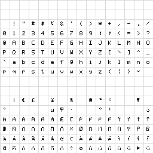
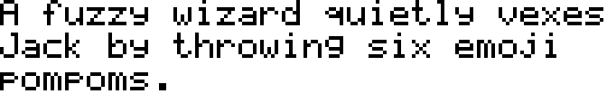

# Retro text font

The Emoji Explorer retro theme also uses a separate pixel text font for UI
labels, headings, and buttons. Unlike the emoji font, this face is a compact
Latin bitmap-inspired companion intended for ordinary interface text rather
than Unicode emoji sequences.

## Purpose

The retro theme is meant to feel cohesive rather than merely recolored. The
5×7 text face helps that mode read like a deliberate visual system:

- headings and controls feel consistent with the 12×12 emoji artwork
- sizes can snap cleanly to multiples of the 7-pixel cap height
- retro mode can avoid relying on rounded, anti-aliased system text

The font is used by the Explorer UI and is not published as a separate npm
package today.

## Source format

The retro text font is now sourced from editable bitmap assets rather than a
hardcoded character table.

- [Atlas PNG](retro-text/latin-1.png)
- [Row/cell JSON map](retro-text/latin-1.json)
- [Source manifest](retro-text/manifest.json)
- [Sample phrase preview](retro-text/example-phrase.png)

The atlas uses a 16×16 grid of cells inside a 256×256 PNG. Each cell maps to
one character slot, and the adjacent JSON file lists the characters as arrays
of rows containing arrays of cells.

That keeps the source easy to inspect visually, easy to edit in an image
editor, and easy to extend later with more 256-cell pages for additional
character ranges.



The sample phrase used to preview the face is:

> A fuzzy wizard quietly vexes Jack by throwing six emoji pompoms.



## Build

Generate the retro text font with:

```sh
npm run pixel-font:text
```

This rebuilds the generated bitmap module, refreshes the sample preview, and
writes the compiled font output under `pixel-font/build-retro-text/`.

## Editing workflow

1. Edit `retro-text/latin-1.png` to change glyph pixels.
2. Update `retro-text/latin-1.json` if a cell should map to a different
   character.
3. Run `npm run pixel-font:text`.
4. Review the refreshed preview image and rebuilt font files.

When the font needs characters outside the current Latin-1 page, add another
16×16 page to the manifest with its own PNG and row/cell JSON map.

## Relationship to Pixel Emoji

Use the retro text font for interface text and the Pixel Emoji font for emoji
rendering. They solve different problems:

- **Pixel Emoji:** fallback emoji coverage for newer Unicode releases
- **Retro text font:** theme-specific UI text styling

For the emoji font itself, see [PIXEL_EMOJI.md](PIXEL_EMOJI.md).
